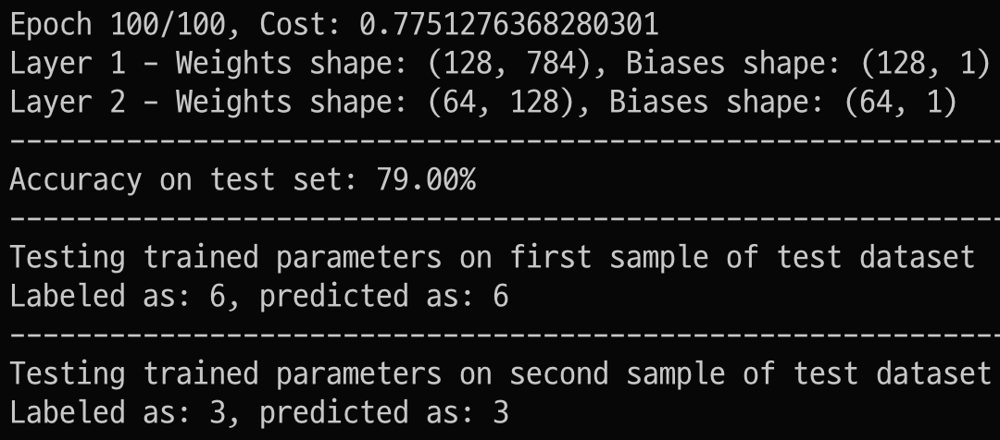

# Deep Feedforward Neural Network on MNIST dataset from scratch

## check out my notes on:
**forward propagation** (computing the output of a neural network):
- [Single Neurons & activation functions](./notes/single-neuron.pdf)
- [Neural Networks (multi-layer perceptron) & walkthrough handwirting interpretation](./notes/neural-networks.pdf)

**back propagation** (updating the network's weights by correcting its mistakes):   
- [learning (hill-climb & gradient descent](./notes/learning-optimization.pdf)
- [back propagation algorithm](./notes/backpropagation.pf)

# implementing  Neural Network:
This project implements a simple neural network to classify handwritten numbers from the mnist dataset. 
You can define the number of layers, neurons per layer, activation functions, and other training parameters via command-line arguments.

The following libraries are used:
- zipfile: For extracting dataset files.
- numpy: For numerical computations.
- pandas: For data manipulation.
- matplotlib.pyplot: For plotting images.
- sklearn.metrics: For evaluating the model's performance.

## Workflow
**Dataset Loading**
- Extract the dataset from a ZIP file and load it into a Pandas DataFrame.
- Convert the DataFrame to a NumPy array and prepare the training and test datasets.

**Dataset Preparation**
- Shuffle the dataset and split it into training and test sets.
- Normalize the features to ensure pixel values are between 0 and 1.

**Initialize Parameters**
- Define a function to initialize random weights and biases for each layer in the network.

**Activation Functions**
- Implement the ReLU and Softmax activation functions.

**Forward Propagation**
- Define a function to perform forward propagation through the network using the activation functions.

**Cost Function Calculation**
- Implement a cost function to calculate the cross-entropy loss between predictions and true labels.

**Backward Propagation**
- Define a function to perform backward propagation to compute gradients of the cost function with respect to the parameters.

**Parameter Update**
- Implement gradient descent to update the parameters using the computed gradients.

**Train Network**
- Define a function to train the neural network using the training data, specified architecture, learning rate, and tolerance for convergence.

**Predict**
- Implement a function to predict labels for given input features using the trained network.

**Predict Single Example**
- Define a function to predict the label for a single input sample.
- Implement a function to visualize an input image and compare the true label with the predicted label.

## Usage

```sh
# install dependencies
pip install -r requirements.txt
# get to know the dataset
python visualize_mnist.py
# train network with default parameters
python neural_network.py
# train neural_network with specific parameters (don't specify to use the default option)
python neural_network.py --layers <layer_sizes> --activations <activation_functions> --learning_rate <learning_rate> --max_iterations <iterations> --tolerance <tolerance> --train_file <train_file> --test_file <test_file>
```

### Arguments

- `--layers`: Neurons per layer (default: `128 64 10`).
- `--activations`: Activation functions per layer (default: `relu relu softmax`).
- `--learning_rate`: Learning rate for training (default: `0.01`).
- `--max_iterations`: Max training iterations (default: `200`).
- `--tolerance`: Cost change tolerance for stopping (default: `0.001`).
- `--train_file`: Path to the ZIP file with the training CSV (default: `./input/train.csv.zip`).
- `--test_file`: Path to the ZIP file with the test CSV (default `./input/test.csv.zip`).

### Example

```bash
python neural_network.py --layers 128 64 10 --activations relu relu softmax --learning_rate 0.01 --max_iterations 200 --tolerance 0.001 --train_file ./data/train.csv.zip --test_file ./data/test.csv.zip
```
the output should look like:


have fun tinkering :)
