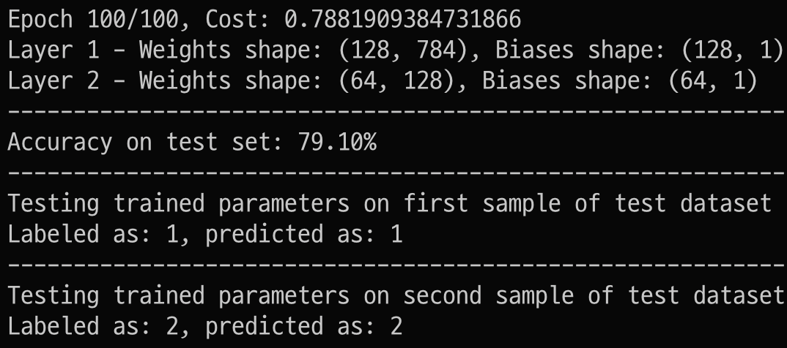

# Neural Network Implementation
This project implements a simple neural network to classify handwritten numbers from the mnist dataset. 

The following libraries are used:
- zipfile: For extracting dataset files.
- numpy: For numerical computations.
- pandas: For data manipulation.
- matplotlib.pyplot: For plotting images.
- sklearn.metrics: For evaluating the model's performance.

## Workflow
**Dataset Loading**
- Extract the dataset from a ZIP file and load it into a Pandas DataFrame.
- Convert the DataFrame to a NumPy array and prepare the training and test datasets.

**Dataset Preparation**
- Shuffle the dataset and split it into training and test sets.
- Normalize the features to ensure pixel values are between 0 and 1.

**Initialize Parameters**
- Define a function to initialize random weights and biases for each layer in the network.

**Activation Functions**
- Implement the ReLU and Softmax activation functions.

**Forward Propagation**
- Define a function to perform forward propagation through the network using the activation functions.

**Cost Function Calculation**
- Implement a cost function to calculate the cross-entropy loss between predictions and true labels.

**Backward Propagation**
- Define a function to perform backward propagation to compute gradients of the cost function with respect to the parameters.

**Parameter Update**
- Implement gradient descent to update the parameters using the computed gradients.

**Train Network**
- Define a function to train the neural network using the training data, specified architecture, learning rate, and tolerance for convergence.

**Predict**
- Implement a function to predict labels for given input features using the trained network.

**Predict Single Example**
- Define a function to predict the label for a single input sample.
- Implement a function to visualize an input image and compare the true label with the predicted label.

## Usage
```python
# install dependencies
python3 -m venv env
source env/bin/activate
pip install -r requirements.txt
# train and test model
python train_test_model.py
# visualize dataset
python visualize_mnist.py
```

output of train_test_model.py


## Customization
- Modify the layers list in the run_architecture function to change the architecture of the network.
- Adjust max_iterations, learning_rate, and tolerance in the train_model function to fine-tune the training process.
